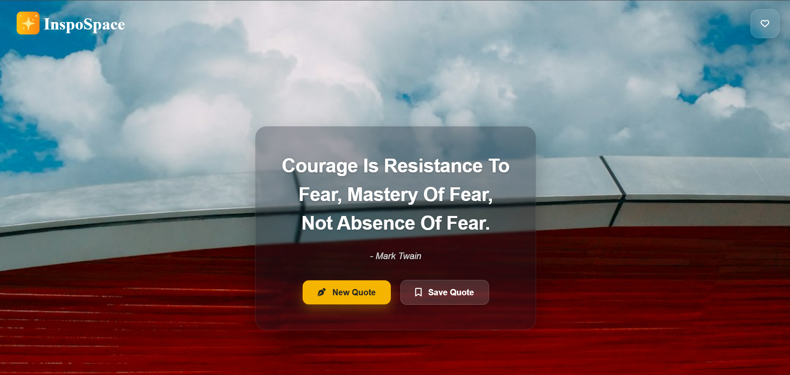
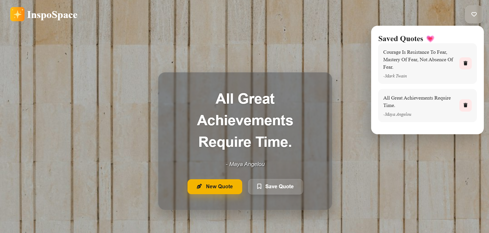
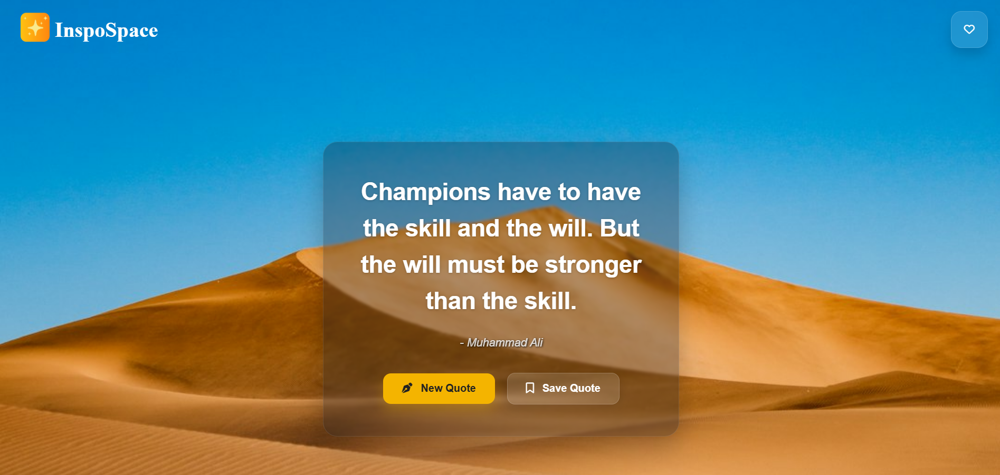

# ✨ InspoSpace

InspoSpace is a quote discovery web application built using HTML, CSS, and JavaScript. It displays random quotes with dynamic background images while demonstrating REST API integration and modern JavaScript concepts.

## 🌐 Live Demo

🔗 https://inspospace.netlify.app/

## 📂 Repository

🔗 https://github.com/tanvie029-cpu/Inspospace

## 📸 Preview 

### Home Screen



### Saved Quotes



### Dynamic Background



---

## 🚀 Features

- Generate random quotes
- Dynamic background images using Unsplash API
- Save favourite quotes
- Delete saved quotes
- Responsive interface
- Error handling for API requests

---

## 🛠️ Tech Stack

- HTML5
- CSS3
- JavaScript (ES6)
- Fetch API
- Async / Await
- DummyJSON Quote API
- Unsplash API
- Font Awesome

---

## 📚 What I Learned

- DOM Manipulation
- Event Handling
- Working with Arrays & Objects
- Fetch API
- REST APIs
- Async / Await
- Error Handling using try...catch
- Reading API Documentation
- Working with Nested JSON Objects

---

## ⚙️ Setup

1. Clone the repository

```bash
git clone YOUR_REPOSITORY_LINK
```

2. Replace the Unsplash Access Key in `script.js` with your own key.

3. Open `index.html` in your browser.